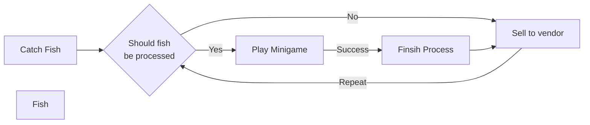

# Core loop

## fish-roster
### basic
- [x] Cod
- [x] Salmon
- [x] Chub
- [x] Perch
### special
- [x] Pufferfish
- [x] Tiger Shark
- [ ] Squid
### idle
- [ ] Crab
- [ ] Lobster
### boss
- [x] Hammerhead

## catching-minigame-archetypes
### bar
